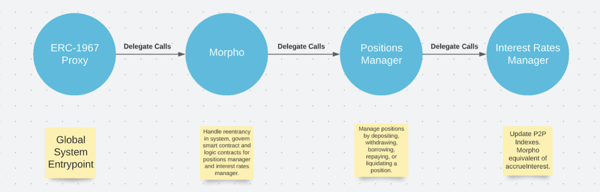

# Overview

The Volt Protocol team conducted a security review of the Morpho protocol. Morpho is a protocol to match suppliers and borrowers in a peer to peer manner. Compared to markets like Compound and Aave, Morpho offers an improvement on lending markets that is strictly better for both lenders and borrowers as long as the underlying markets are liquid. Because of the size of the codebase and complexity, the review focused on a few key system aspects where there was the highest probability of finding issues. The first spot was the setup of the proxy smart contract system. This meant checking for storage overwrite issues where a proxy would overwrite storage that was meant for another variable in a different contract, hijacking implementation proxies, and any other issues that could result from this unique implementation of a proxy smart contract system. Other issues that were checked included reentrancy and access controls. Verifying mathematical formulas and data structures within the system was out of scope for this review.

## Underlying Venue Risk

There are currently two Morpho markets, Morpho-Aavev2 and Morpho-Compoundv2. While on the Morpho side they have the same peer to peer matching mechanism, the two implementations differ largely, and their risk is greatly influenced by the underlying markets. Volt Protocol has previously conducted a security review of Compoundv2, available here. The issues discovered in that report have a pending mitigation in governance. A separate Aave security review will need to be completed before Morpho-Aavev2 integration can proceed.

## Team Security Posture

Before diving into smart contract implementations, architecture and the different heuristics that informed this report, it is important to first understand the internal security posture of the Morpho team. The current smart contract implementation has received 12 audits from top audit firms including Trail of Bits, Pessimistic, Chainsecurity, Spearbit and Omniscia. Code has been formally verified by Certora, a leading smart contract formal verification company. There is a strong internal review process in place before code goes out to audit and mainnet with CI tests being run against all PR’s and new code. Code is very thoroughly tested as there are currently 270 foundry tests, with this test suite being expanded all the time. Additional formal verification work is being done by an internal engineer with a PhD in the field. Internally, a tool has been developed to ensure smart contract upgrades do not cause storage clashes or otherwise interfere with the functioning or integrity of the system. An external red team has been engaged multiple times to try and break the system. The current Immunefi bug bounty for critical issues is $555k. Combining all of these items together, demonstrates a strong commitment to security by the Morpho team. Using different types of security tools and methods for testing as well as having a rigorous review process and high quality external security engineers reviewing code ensures that the likelihood of a critical issue making its way into a live system is as low as possible.

## Audit Reports

The Volt Protocol team reviewed the following audit reports, checking carefully to see what types of issues made it to audit.

[Omniscia audited the ERC4626 tokenized vaults](https://omniscia.io/reports/morpho-labs-tokenized-vaults/). Overall, there were no critical findings, and the one “high” issue that was found, relating to decimals, was invalid per the Morpho team.

[Chainsecurity audited the Morpho Aave V3](https://cdn.morpho.xyz/documents/MorphoAaveV3_Audit_ChainSecurity.pdf) integration and found no critical issues. The only issue of note was one high issue that was already understood by the Morpho team. There were low issues relating to variable shadowing, admins having the ability to take AAVE rewards, and some gas optimizations.

[Omniscia audited the Morpho Aave V2 data structures and found no critical, high or medium issues](https://cdn.morpho.xyz/documents/MorphoAaveV2_Audit_Omniscia.pdf). Issues found mostly amounted to gas optimizations, and there were no logic errors found in this audit that would affect the integrity of the system.

[Spearbit audited the Morpho Aave V2 smart contracts](https://cdn.morpho.xyz/documents/MorphoAaveV2_Audit_Spearbit.pdf) and found several critical and high issues.

[Pessimistic audited the Morpho Aave V2 smart contracts](https://cdn.morpho.xyz/documents/MorphoAaveV2_Audit_Pessimistic.pdf) and found no critical issues. 

[Trail of Bits audited the Morpho Compound V2 smart contracts](https://github.com/morpho-dao/morpho-core-v1/blob/main/audits/Morpho%20Labs%20Final%20Report.pdf) and found 1 critical issue relating to hijacking an implementation smart contract and self-destructing it. It is important to note that in the current smart contract architecture, even if the implementation smart contracts could be hijacked and destroyed, due to the ERC-1967 proxy smart contract, an upgrade could occur, changing the pointers to the logic contract. This issue was fixed by the Morpho team and does not exist in live code. The conclusion of this is even an implementation smart contract being destroyed would not take down the Morpho system.

## Smart Contract Architecture
Morpho leverages an upgradeable proxy storage pattern that uses a single smart contract to handle all business logic implementation. Storage contract that forwards all calls on to the implementation contract. The proxy pattern used is EIP-1967 which allows for the admin and logic smart contract to be changed by the owner of the smart contract. Currently the smart contracts are owned by a multisig using the zodiac smart contract system which builds on top of gnosis safe’s implementation.
On top of this proxy smart contract, the business logic smart contract delegates to yet another smart contract. While this is complex, there are no signs of code smells that indicate more junior developers or less experienced solidity engineers, which allows Volt to feel confident in Morpho’s implementation.

### Uninitialized Smart contracts
One large security vector with upgradeable smart contracts is leaving deployed logic contracts open to initialization such that a malicious user could then take ownership of the logic contract, and then either self-destruct the contract, or do other malicious actions that would interfere with the normal operation of the smart contract system. All smart contracts in Morpho use a design pattern where the constructor initializes the smart contract’s initializer variable, which means the initialize function can only be called by the proxy smart contract.

### Storage Clashes
A large component of writing secure upgradeable smart contracts is ensuring no storage clashes happen between separate smart contracts. A storage clash is a vulnerability that occurs when two separate smart contracts that operate on the same storage smart contract write to the same storage slot with a different variable. A simple example of this could be an ownable contract and another contract that tracks a token and the corresponding balance of that token in the smart contract. If both smart contracts are executed in the context of a single diamond proxy contract, any change to the token being viewed will change the owner of the contract as well. An example of this type of storage clash causing loss of funds in the wild was the Audius hack. `MorphoStorage.sol` is a smart contract that contains all of the storage variables for the main Morpho.sol smart contract. LensStorage.sol is a smart contract containing all of the storage variables for the main Lens.sol smart contract. Because Morpho.sol and Lens.sol are separate smart contracts, neither smart contract storage contract inherits from the other. All interactions between the Morpho and Lens smart contracts happen through calls and not delegate calls, which removes this vector for an attack. Storage clashes could still happen during an upgrade process if proper due diligence was not conducted into the new code and the state of the system once upgraded. However, this type of mistake seems unlikely given the Morpho team’s strong security posture.

### PositionsManager.sol
The PositionsManager smart contract is in charge of managing the 5 main actions that a user can take, supply, withdraw, borrow, repay, and liquidate. This is a logic contract that stores no state. Instead it is responsible for P2P matching and ensuring interest accrual function gets called. It is delegatecalled from within the Morpho.sol smart contract.

### Morpho.sol
The main smart contract in the system is `Morpho.sol`. This smart contract is responsible for handling all p2p matching, tracking each users assets and liabilities and allowing users to claim their Comp rewards. The Morpho logic contract is behind an ERC-1967 proxy contract. This Morpho logic contract then delegatecalls the positions manager logic contract to supply, borrow, withdraw, repay, and liquidate.

### Reentrancy
All external contract interactions with Compound through the positions manager logic contract are behind a reentrancy lock. Having this monolithic design that is more similar to a diamond pattern than a traditional proxy storage pattern coupled with reentrancy locks provides strong security guarantees as all state mutating logic lives inside a single contract, and all state mutating functions have reentrancy locks, except governor actions where only the owner can change state.

>Diagram from Morpho developer docs

The proxy contract delegatecalls `Morpho.sol`, which delegatecalls `PositionManager`, which delegatecalls `InterestRatesManager` before allowing a deposit, withdraw, borrow, repay or liquidate action. This is a long chain of delegatecalls, however the Volt team feels confident that this complex logic chain is architected correctly as great care was taken to ensure no storage clashes were possible, and logic contracts cannot be re-initialized and hijacked. As these are the two main attack vectors for upgradeable smart contracts, and this system as a whole, reviewing how this works provided a strong foundation for understanding the system architecture.

>Diagram of system delegatecalls and overview of how the system works during a single user interaction.

### Protocol Fees
Morpho Protocol has the ability to charge fees in their markets. Currently, fees are disabled, but governance can set them up to 100% to divert all fees to the DAO. The only scenario in which this is likely is during an asset delisting when users aren’t force liquidated. This high fee incentivizes suppliers to remove their liquidity as seen in the recent Compound Fei delisting governance action. Fees are unlikely to be enabled in the short to medium term because they would likely cause a drop in TVL at an early stage of the project which is undesirable.

### Smart Contract Dependencies
The Morpho codebase leverages the Openzeppelin library. The Morpho team has locked all dependency versions in their package.json. This ensures that a malicious upgrade to one of their projects dependencies does not impact their protocol. Locking dependency versions is a high quality signal that the Morpho team takes security very seriously.

### mTokens
Initially, the Volt Protocol team assumed that Morpho issued an ERC20 that represented a tokenized receipt of deposit into Morpho. After reviewing the code and documentation, it was discovered that there was no concept of an mToken. This means that PCV Guardian functions withdrawERC20ToSafeAddress and withdrawAllERC20ToSafeAddress will not work with removing Morpho Tokens on the Morpho PCV Deposit because Morpho has no concept of mTokens. This does not impact security, but means that if the Morpho deposit were to become illiquid or take on bad debt, it would not be so easy to do things like distribute shares pro rata to VOLT holders, or auction off shares for price discovery in the event of loss.

## Governance
The Morpho governance system leverages a novel governance model called Zodiac, which is a library built on top of Gnosis. This design was likely used so that instead of rolling their own ACL system, a pre-existing and battle tested protocol could be used. Morpho plans for progressive decentralization, with the next step on their governance roadmap being token voting through Reality, an oracle framework within Gnosis Safe that allows the outcomes of an event outside the blockchain to be reported and executed on chain.

There are two main multisig wallets that Morpho Utilizes. The first is a 5/9 multisig that governs the main Morpho contract. This multisig has the ability to upgrade the protocol without going through a timelock, which for this stage of a project is acceptable as being able to move fast in an emergency is good. The second multisig is a 3/5 multisig that can pause, unpause, disable and enable peer to peer matching in markets. This is analogous to the PCV Guard role in the Volt system.

The Morpho documentation describes a roadmap of progressive decentralization over time. This method of progressive decentralization is incredibly transparent and we applaud the Morpho team for being open with the community on the current stage of governance and working to further decentralize their governance in a meaningful way.

Changes introduced by governance, either in the underlying venues or in Morpho itself, are one of the most likely sources of risk to Morpho. Volt Protocol is working to set up monitoring infrastructure for governance in all integrated venues, and will conduct review of governance proposals, or withdraw funds if this is not possible in a timely manner and wait to re-integrate until review is completed.

## Risk and Mitigations

### Protocol Monitoring
Because Morpho uses proxies, and can upgrade the smart contract implementation at any point in time through a multisig, the Volt Protocol team has created a custom script that monitors the Morpho storage contract and sends the team a notification if Morpho ever upgrades the logic contract. This script is a last line of defense because the Volt team is in communication with Morpho and monitors communication channels such as their governance forum and twitter account. The Morpho team is highly credible, and unlikely to make major unannounced changes.

### Liquidity Risks
Depositing into Morpho presents the same liquidity risks as Compound. That is, if the Compound market Volt Protocol enters becomes illiquid, Volt will be unable to process redemptions beyond the liquidity that is currently in PSM’s for redemptions. Bad debt being created on Compound from an oracle manipulation attack as described in the Volt Compound audit would create a race for the exit situation that could impact Morpho the same way it would any other Compound users. If this type of liquidity crisis occured due to bad debt in Compound, Volt Protocol would act quickly to preserve PCV by utilizing the PCV Guards to withdraw funds to safety. In a future version of the Volt Protocol, an automated sentinel will allow any user to present evidence of bad debt in an underlying venue and immediately pull funds to safety and pause the corresponding PCV deposit.

# Conclusion
Morpho is a team that spends a lot of time and resources thinking about the security of their system. Their design patterns are quite advanced, as the reviewer has never seen multiple chained delegatecalls in a smart contract system before. This type of layered proxies demonstrates technical prowess, especially with clean code, formal verification, and high test coverage. No one method of security is bulletproof, and ensuring no bugs make their way to mainnet is a complicated problem requiring many types of tools and both internal and external security reviews. The level of attention to detail and security makes Volt feel confident deploying PCV into the Morpho-Compound V2 venue.

